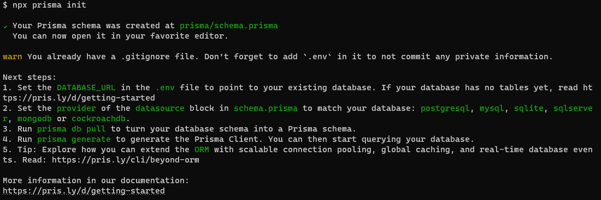

# 确保有一个nest项目

- npm install prisma --save-dev

# 初始化prisma

- npx prisma init

- 或者指定数据库（默认是 postgreSQL）

- npx prisma init --datasource-provider mysql

# 操作提示

- 

# 如果mysql等源数据库已经有数据，则使用

- npx prisma db pull 从源端数据库拉取数据

# 如果prisma\schema.prisma中有新model，则使用

- npx prisma db push 将数据表结构同步到数据源中

# seed 数据库

- 如果运行有问题，建议使用https://nestjs-prisma.dev/docs/installation/
- 初始化seed数据
- 注意要在prisma\seed.ts以及index.ts中添加对应的代码
  import { PrismaClient } from '../../generated/prisma/client';
- 特别注意PrismaClient的路径指向，client应该是 npx prisma generate 生成的路径内容
- npx prisma db seed
- 此时数据源中应该有数据

[玩转 Nest Cli](https://juejin.cn/post/7338265878288515135)https://juejin.cn/post/7338265878288515135
[nestjs-prisma](https://nestjs-prisma.dev/docs/installation/)https://nestjs-prisma.dev/docs/installation/
